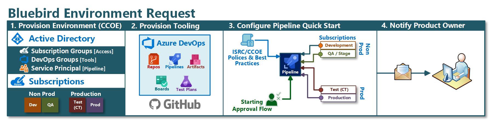
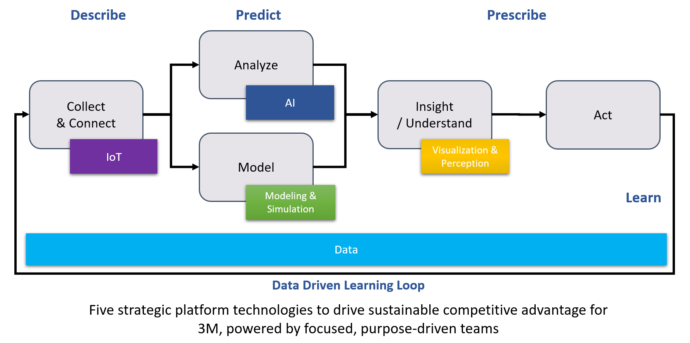

## Bluebird Project Overview

The Bluebird project inside of 3M is a collection of processes, tools and platforms. This project is maintained by the Corporate Research System Lab (CRSL). In addition to CRSL this project is closely collaborated on with both the Cloud Center of Excellence (CCOE) and Information Security Risk & Compliance (ISRC) teams.

The goal of the project is to create platforms and automation tooling for the Microsoft Azure cloud. In addition several existing 3M processes have been enhanced to support better DevOps practices and tooling along with enterprise production and security best practices.

This project leverages Inner-Source and Open-Source to be successful. No single team inside of 3M has the ability to maintain, advance, and contribute to an effort this large. If you are interested in contributing or are unfamiliar with these concepts please see the [contact page](./resources/contact.html).

!!! Warning
    This content is still under construction. We are actively building out key areas but you may find empty pages, spelling and grammar issues, and other atrocities your high school English teacher would abhor. Feel free to contribute suggestions or updates by clicking the GitHub link in the top right and either creating an issue to alert us or a pull request to fix the problem. We appreciate your patience.

## Process Highlights

The first thing to understand about the Bluebird process and tooling is that at the core it is a process improvement for Azure cloud projects inside of 3M that want to leverage DevOps. It is designed to be a very thin layer on top of a common subscription, security and tooling structure. This thin layer allows CRSL, CCOE and ISRC to respond to the ever changing Azure landscape while allowing divisions, labs or other internal users to practice proper DevOps and deployment automation.

## Platforms

Platforms are built on top of the Bluebird process and tooling. The current platforms supported by the Bluebird process are:

* **[Internet of Things (IoT) Platform](./iot/index.html)**: Platform that can be leveraged to connect, secure and manage smart devices for commercial, manufacturing or experimental projects.
* **[Artificial Intelligence (AI) & ML Ops Platform](./ai/index.html)**: Platform that can be leveraged to track experiments, create models, and deploy those models (e.g. custom endpoint, mobile app, web, IoT edge).
* **[Modelling as a Service (Maas)](./maas/index.html)**: Also known as the model hub. Focused on the creation of physical, mathematical or conceptual models leveraging cloud high performance compute (HPC).
* **[Data Platform](./data/index.html)**: Platform that can be leveraged to transport, store, refine and react to batch or streaming data.
* **[Visualization & Perception](./resources/contact.html)**: Coming soon.

